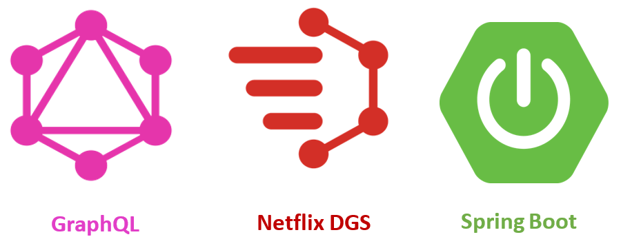

# neflixdgs-graphql-javaapp
Start GraphQL with Netflix DGS framework and Spring Boot



## Launch it with docker
```bash
docker run --rm -it -v $(pwd):/project -w /project -p 9993:9993 maven:3.8.6-openjdk-18 mvn spring-boot:run
```

## Access to web application
http://localhost:9993/graphiql


Mutation: 


H2 Database:


Query:

